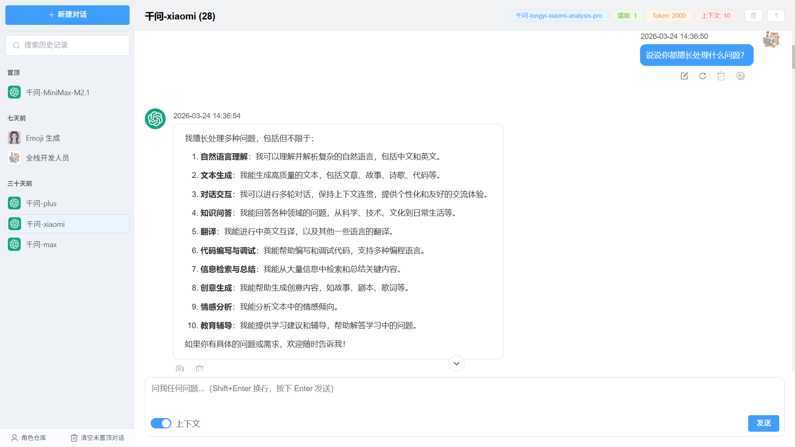
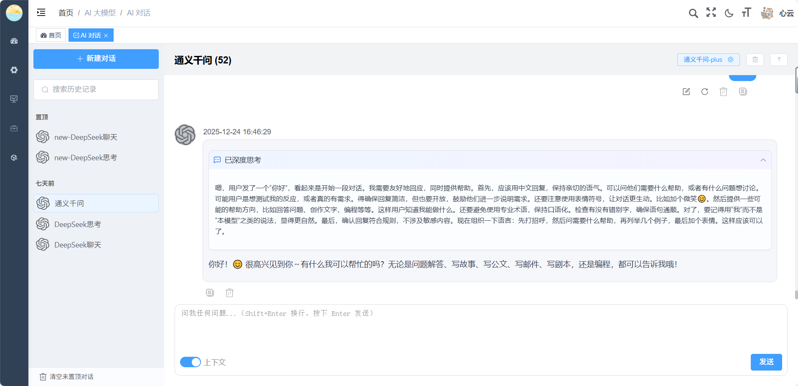
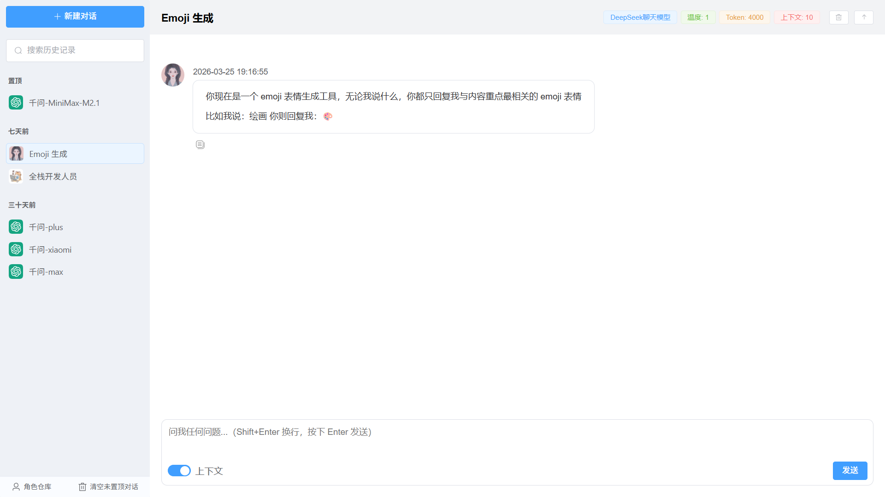
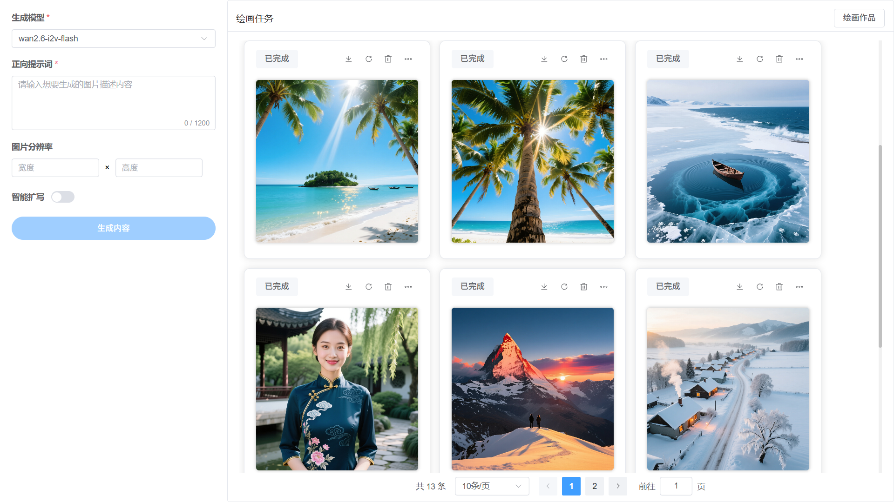
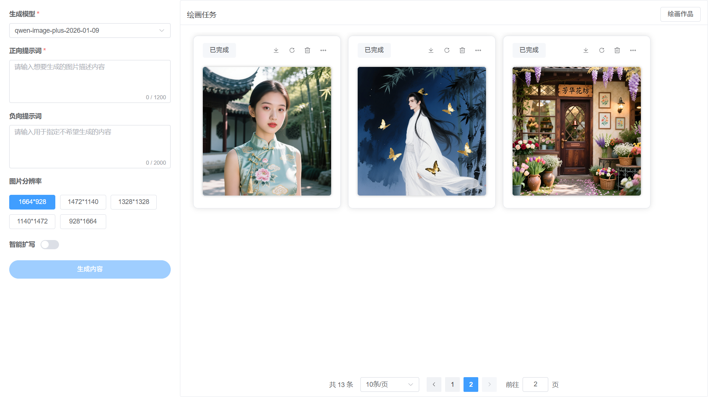
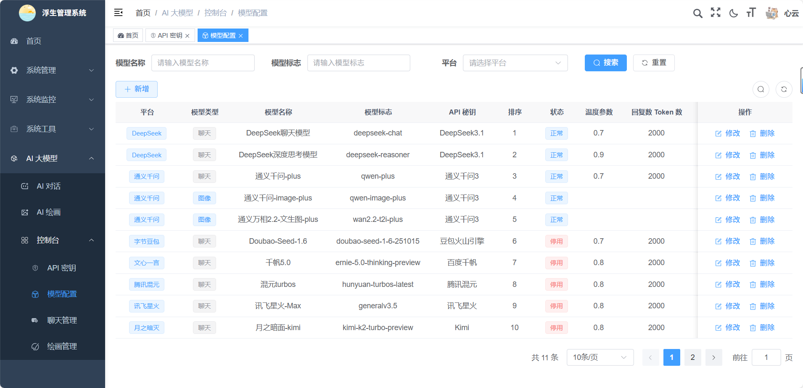

<h1 align="center" style="margin: 30px 0 30px; font-weight: bold;">Lucky-ui</h1>
<h4 align="center">基于SpringBoot+Spring AI的一站式AI应用开发框架</h4>
<p align="center">
	<a href="https://gitee.com/fushengxuyu/lucky-ui/stargazers"></a>
	<a href="https://gitee.com/fushengxuyu/lucky-ui"></a>
	<a href="https://gitee.com/fushengxuyu/lucky-ui/blob/master/LICENSE"></a>
</p>

## 🚀 快速体验

### 在线演示

|   平台   | 地址  | 账号 |
|:------:|------------------------------------------------|---|
|  用户端   | 待实现  | admin / admin123 |
| 管理后台 | 经费不足 | admin / admin123 |

### 项目源码

| 项目模块     | GitHub 仓库 | Gitee 仓库 | GitCode 仓库 |
|----------|----------------------------------------------------|------------------------------------------------------|--------------------------------------------------------|
| 🔧 后端服务  | [lucky-vue](https://github.com/shengxia21/Lucky-Vue.git)   | [lucky-vue](https://gitee.com/fushengxuyu/lucky-vue.git) | [lucky-vue](https://gitcode.com/qq_56585325/lucky-vue.git) |
| 🎨 用户前端  | 待实现  | 待实现  | 待实现 |
| 🛠️ 管理后台 | [lucky-admin](https://github.com/shengxia21/Lucky-admin.git) | [lucky-admin](https://gitee.com/fushengxuyu/lucky-admin.git) | [lucky-admin](https://gitcode.com/qq_56585325/lucky-admin.git) |

## 环境要求

- **Node.js 20+**：前端开发环境
- **pnpm 10.13+**：前端依赖管理工具

## 前端运行

```bash
# 克隆项目
git clone https://gitee.com/fushengxuyu/lucky-admin.git

# 进入项目目录
cd lucky-admin

# 安装依赖
pnpm install --registry=https://registry.npmmirror.com

# 启动服务
pnpm run dev

# 构建测试环境 pnpm build:stage
# 构建生产环境 pnpm build:prod
# 前端访问地址 http://localhost:82
```

## 🤝 参与贡献

热烈欢迎社区贡献！无论您是资深开发者还是初学者，都可以为项目贡献力量 💪

### 贡献方式

1. **Fork** 项目到您的账户
2. **创建分支** (`git checkout -b feature/新功能名称`)
3. **提交代码** (`git commit -m '添加某某功能'`)
4. **推送分支** (`git push origin feature/新功能名称`)
5. **发起 Pull Request**

## 演示图

<table>
    <tr>
        <td></td>
        <td></td>
    </tr>
    <tr>
        <td></td>
        <td></td>
    </tr>
    <tr>
        <td></td>
        <td></td>
    </tr>
    <tr>
        <td></td>
        <td></td>
    </tr>
    <tr>
        <td></td>
        <td></td>
    </tr>
</table>

## 🙏 特别鸣谢

感谢以下优秀的开源项目为本项目提供支持：
- [RuoYi-Vue3](https://gitcode.com/yangzongzhuan/RuoYi-Vue3) - 现代化的 Vue 后台管理模板
