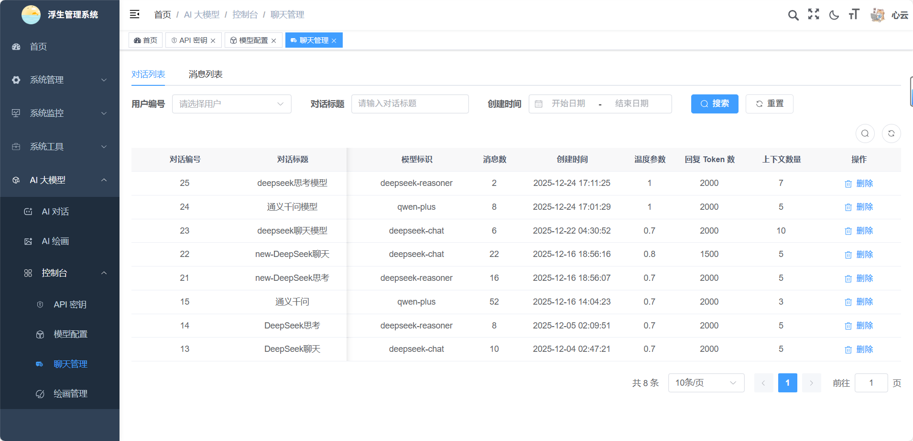
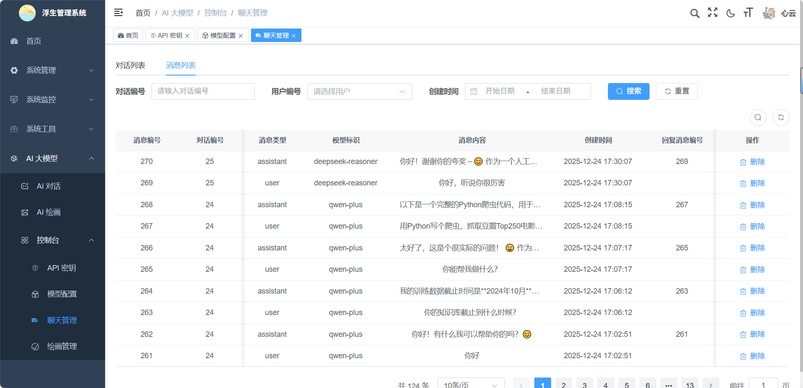
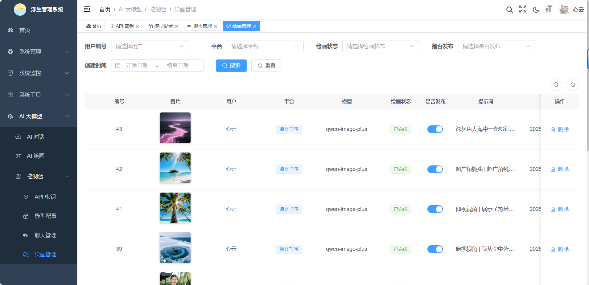
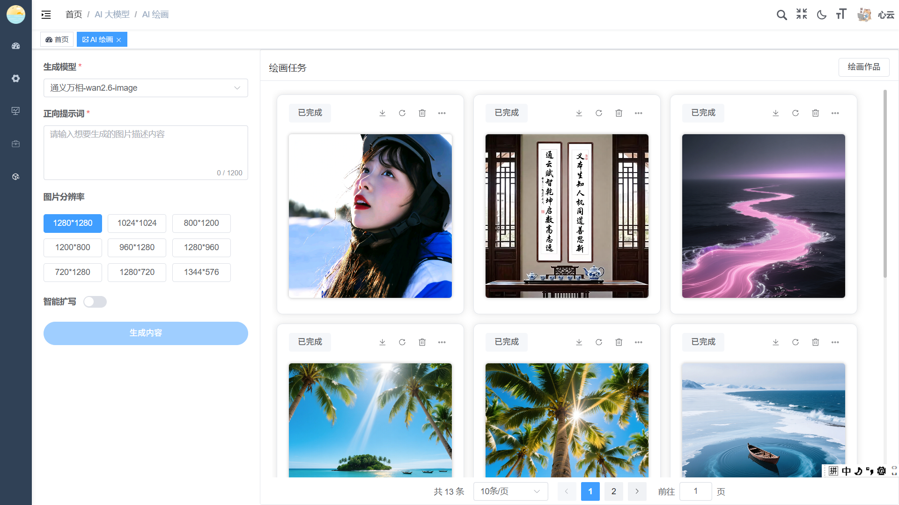

<h1 align="center" style="margin: 30px 0 30px; font-weight: bold;">Lucky v1.0.0</h1>
<h4 align="center">基于SpringBoot+Vue3前后端分离的Java快速开发框架</h4>
<p align="center">
	<a href="https://gitee.com/fushengxuyu/lucky-vue/stargazers"></a>
	<a href="https://gitee.com/fushengxuyu/lucky-vue"></a>
	<a href="https://gitee.com/fushengxuyu/lucky-vue/blob/master/LICENSE"></a>
</p>
<p align="center">
	
	
</p>

## 平台简介

* 本仓库为前端技术栈 [Vue3](https://v3.cn.vuejs.org) + [Element Plus](https://element-plus.org/zh-CN) + [Vite](https://cn.vitejs.dev) 版本。
* 配套后端代码仓库地址[Lucky-Vue](https://gitee.com/fushengxuyu/lucky-vue)。

## 前端运行

```bash
# 克隆项目
git clone https://gitee.com/fushengxuyu/lucky-ui.git

# 进入项目目录
cd lucky-ui

# 安装依赖
pnpm install --registry=https://registry.npmmirror.com

# 启动服务
pnpm run dev

# 构建测试环境 pnpm build:stage
# 构建生产环境 pnpm build:prod
# 前端访问地址 http://localhost:82
```

## 内置功能

1.  用户管理：用户是系统操作者，该功能主要完成系统用户配置。
2.  部门管理：配置系统组织机构（公司、部门、小组），树结构展现支持数据权限。
3.  岗位管理：配置系统用户所属担任职务。
4.  菜单管理：配置系统菜单，操作权限，按钮权限标识等。
5.  角色管理：角色菜单权限分配、设置角色按机构进行数据范围权限划分。
6.  字典管理：对系统中经常使用的一些较为固定的数据进行维护。
7.  参数管理：对系统动态配置常用参数。
8.  通知公告：系统通知公告信息发布维护。
9.  操作日志：系统正常操作日志记录和查询；系统异常信息日志记录和查询。
10. 登录日志：系统登录日志记录查询包含登录异常。
11. 在线用户：当前系统中活跃用户状态监控。
12. 代码生成：前后端代码的生成（java、html、xml、sql）支持CRUD下载。
13. 系统接口：根据业务代码自动生成相关的api接口文档。
14. 服务监控：监视当前系统CPU、内存、磁盘、堆栈等相关信息。
15. 缓存监控：对系统的缓存信息查询，命令统计等。
16. 连接池监视：监视当前系统数据库连接池状态，可进行分析SQL找出系统性能瓶颈。
17. AI 对话：集成AI对话功能，用户可以与系统进行自然语言交互。
18. AI 绘画：集成AI绘画功能，用户可以通过自然语言描述生成对应的图片。
19. API 密钥：配置自己的API密钥，以使用AI功能。
20. 模型配置：配置使用的AI模型，如DeepSeek、通义千问等。
21. 聊天管理：查看和管理AI对话的聊天记录。
22. 绘画管理：查看和管理AI生成的绘画记录。
23. 聊天角色：配置AI聊天角色，每个角色拥有自己的系统提示词。

## 后续实现功能

1. AI聊天角色：配置AI聊天角色，每个角色拥有自己的系统提示词。(已实现)
2. 文件上传：AI对话聊天支持用户上传文件、图片等。
3. 联网功能：集成大模型联网搜索功能，联网后AI模型可以根据网络搜索结果进行回答。
4. AI思维导图：集成AI思维导图功能，用户可以通过自然语言描述生成对应的思维导图。
5. AI知识库：配置AI知识库，AI大模型会根据知识库的内容进行智能问答。
6. 视频创作：集成AI视频，用户可以通过自然语言描述生成对应的视频。
7. RAG功能：集成RAG功能，提供应用场景。
8. MCP功能：集成MCP功能，提供应用场景。
9. Agent功能：集成Agent功能，提供应用场景。

## 在线体验

- 演示账号：lucky
- 演示密码：admin123

演示地址：https://yuanlin.asia

## 演示图

<table>
	<tr>
		<td></td>
		<td></td>
	</tr>
	<tr>
		<td></td>
		<td></td>
	</tr>
	<tr>
		<td></td>
		<td></td>
	</tr>
	<tr>
		<td></td>
		<td></td>
	</tr>
</table>

## 特此声明

本项目是基于[RuoYi-Vue3](https://gitcode.com/yangzongzhuan/RuoYi-Vue3)项目进行的二次开发，感谢作者提供的优秀代码。
